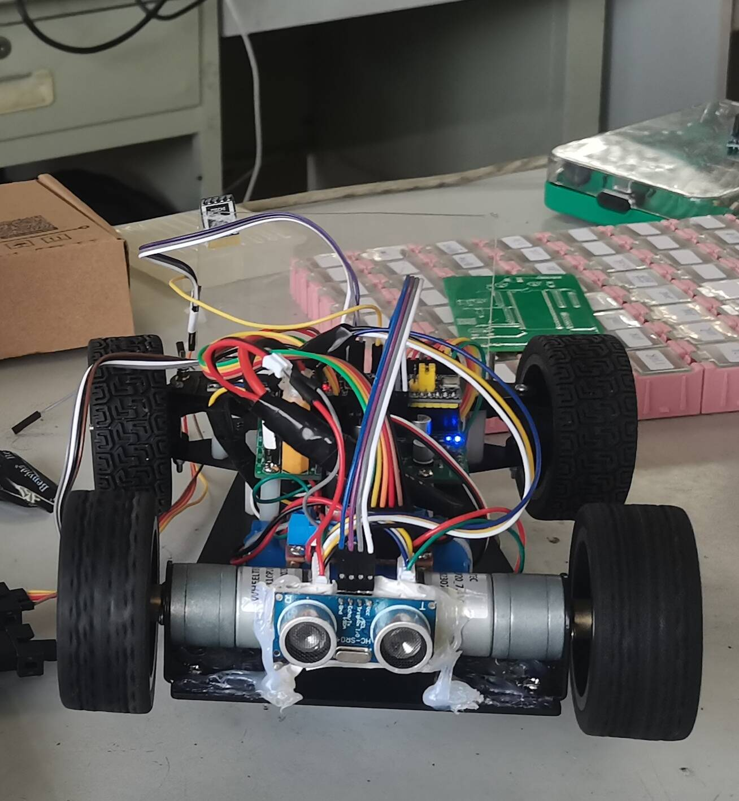
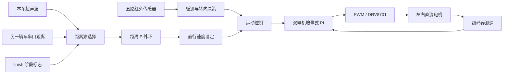

# STM32 双车跟随小车

基于 STM32F103C8T6 的双车协同跟随项目。本仓库收录从车控制固件、STM32 控制板和双路 DRV8701 电机驱动板设计，覆盖红外循迹、车辆测距、双车通信、串级闭环调速及分阶段超车控制。

## 实物展示

<p align="center">
  
</p>

<p align="center">后车实物照片</p>

## 项目概览

从车通过五路红外传感器识别赛道，通过本车超声波或另一辆车发送的距离信息确定跟车速度。距离 P 控制器生成直行速度设定值，双路编码器 PI 控制器进一步调节左右电机 PWM，构成距离外环与速度内环组合的串级控制链路。

模式 2 使用赛道圈数标志 `finish` 描述双车相对位置的变化：从车首先在后方跟随，完成超车后切换为串口距离闭环，另一辆车再次超车后恢复本车超声波闭环。

## 系统架构



循迹转向采用固定差速参数，距离外环主要作用于直行阶段的速度设定。

## 功能组成

- 五路红外循迹与赛道标志线识别。
- 本车超声波距离和串口距离双数据源切换。
- `20~400 mm` 距离有效范围判断与异常数据剔除。
- 目标距离 `200 mm` 的距离 P 外环。
- `10 ms` 更新周期的双电机增量式 PI 速度内环。
- 基于 `finish` 阶段标志的跟随、超车与让行速度策略。
- OLED 距离/轮速显示，以及停车状态蜂鸣器提示。

## 控制阶段

| 工作状态 | 距离反馈 | 距离失效时的速度策略 |
| --- | --- | --- |
| 模式 1、模式 3 | 本车超声波 | 基础速度 40 |
| 模式 2，`finish == 0` | 本车超声波 | 基础速度 40 |
| 模式 2，`finish == 1` | 串口距离 | 找到车辆前为 45，找到后为 40 |
| 模式 2，`finish >= 2` | 本车超声波 | 找到车辆前为 35，找到后为 40 |

## 硬件设计

| 板卡 | 主要内容 | 设计资料 |
| --- | --- | --- |
| STM32 控制板 | STM32 核心板接口、电源、红外、超声波、串口、蜂鸣器和电机控制接口 | [原理图](docs/images/主控板原理图.pdf) · [布线图](docs/images/主控板布线图.pdf) · [丝印图](docs/images/主控板丝印图.pdf) |
| 双路 DRV8701 驱动板 | 双路栅极驱动、外置功率 MOSFET、逻辑缓冲、电源稳压和状态指示 | [原理图](docs/images/驱动板原理图.pdf) · [布线图](docs/images/驱动板布线图.pdf) · [丝印图](docs/images/驱动板丝印图.pdf) |

Altium Designer 源文件分别位于 [控制板目录](hardware/controller-board/README.md) 和 [驱动板目录](hardware/dual-drv8701/README.md)。

## 软件结构

```text
firmware/follower/
├─ User/                主循环、模式切换与距离控制
├─ Hardware/            红外、超声波、编码器、电机、串口和显示驱动
├─ System/PID/          双电机增量式 PI
├─ System/Timer/        超声波计时、轮速计算和控制周期调度
├─ Library/             STM32F10x 标准外设库
└─ Project.uvprojx      Keil uVision 工程
```

## 构建与验证

| 项目 | 配置 |
| --- | --- |
| MCU | STM32F103C8T6 |
| IDE | Keil uVision 5.41 |
| 编译器 | ARM Compiler 5.06 update 5 (build 528) |
| Device Pack | STM32F1xx DFP 2.2.0 |
| 工程目标 | `Target 1` |
| 构建结果 | `0 Error(s), 0 Warning(s)` |

当前版本完成了源码和工程配置的全量编译验证。原项目曾用于实车开发，但整理后的版本因缺少现有实物，尚未重新执行距离切换、超车动作、电机方向和控制参数的硬件回归测试。

## 文档

- [控制设计](docs/control-design.md)
- [串口通信协议](docs/serial-protocol.md)
- [硬件设计资料](docs/images/README.md)
- [构建验证记录](docs/build-verification.md)
- [设计边界与已知限制](docs/known-limitations.md)
- [第三方内容声明](THIRD_PARTY_NOTICES.md)

## 项目边界

仓库中的生产文件未作为已验证投产资料发布；PCB 下单前仍需结合实际元件、板厂工艺和电气要求重新完成 ERC、DRC、BOM 与封装核对。项目源码和硬件资料当前未统一授予开源许可证。
